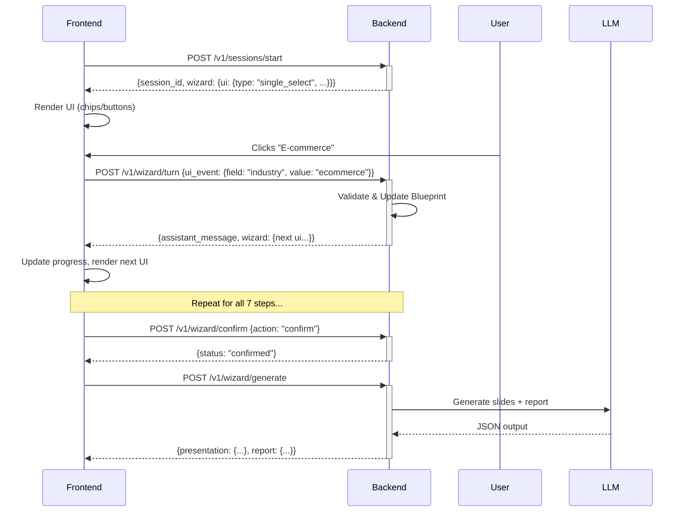

# 🧙‍♂️ BOOM Wizard Engine

> **A production-ready wizard engine backend built with Python/FastAPI that drives a UI-first wizard experience for strategic marketing consultations.**

[](https://python.org)
[](https://fastapi.tiangolo.com)
[](https://redis.io)
[](https://docker.com)

---

## 🎯 What is This?

The BOOM Wizard Engine is a **backend service** that powers a step-by-step strategic marketing wizard. Unlike traditional chatbots, this is a **deterministic state machine** that:

- ✅ Controls the conversation flow (not the LLM)
- ✅ Returns UI directives (what to render)
- ✅ Validates user input at every step
- ✅ Builds a structured "blueprint" (not raw chat)
- ✅ Generates professional presentations and reports at the end

**The frontend (e.g., Google AI Studio) only renders what the backend tells it to render.**

---

## 🚀 Quick Start (3 Steps)

### Option 1: Docker (Recommended)

```bash
# 1. Clone and configure
cd engine_wizard_boom
cp .env.example .env
# Edit .env: Add your OPENAI_API_KEY (or other LLM provider)

# 2. Start everything
docker-compose up -d

# 3. Open your browser
# API: http://localhost:8000
# Docs: http://localhost:8000/docs
```

### Option 2: Local Development

```bash
# 1. Setup Python environment
python -m venv venv
source venv/bin/activate  # Windows: venv\Scripts\activate
pip install -r requirements.txt

# 2. Start Redis
redis-server

# 3. Configure and run
cp .env.example .env
# Edit .env with your settings
python -m app.main
```

---

## 📖 Documentation

| Document | Description |
|----------|-------------|
| **[INDEX.md](INDEX.md)** | 📑 Complete documentation index |
| **[README.md](README.md)** | 📘 Full guide (you are here) |
| **[PROJECT_SUMMARY.md](PROJECT_SUMMARY.md)** | ✅ Implementation summary |
| **[API_REFERENCE.md](API_REFERENCE.md)** | 🔌 API quick reference |
| **[FRONTEND_INTEGRATION.md](FRONTEND_INTEGRATION.md)** | 💻 Frontend integration guide |
| **[ARCHITECTURE.md](ARCHITECTURE.md)** | 🏗️ Architecture diagrams |

**Interactive docs** (when running): http://localhost:8000/docs

---

## ✨ Key Features

### 🎯 Wizard Engine
- **7-step flow**: context → objective → target → value prop → channels → constraints → review
- **UI-first design**: Backend returns complete UI directives
- **Deterministic**: State machine, not LLM-driven flow
- **Real-time validation**: Schema-based field validation
- **Progress tracking**: Visual progress indicators

### 🔌 API
- **RESTful endpoints**: `/sessions/start`, `/wizard/turn`, `/wizard/generate`
- **Idempotency**: Duplicate requests return cached responses
- **Structured responses**: Blueprint + UI directive in every response
- **Error handling**: Clear validation errors and HTTP status codes

### 🔒 Security
- **API key authentication**: Per-tenant API keys
- **HMAC signatures**: Optional request signing
- **Rate limiting**: Built-in protection
- **PII masking**: Automatic log sanitization
- **CORS**: Configurable cross-origin policies

### 🤖 LLM Support
- **Multi-provider**: OpenAI, Google Gemini, Anthropic Claude
- **Abstraction layer**: Easy to swap providers
- **Optional usage**: LLM only for generation, not flow control
- **JSON mode**: Structured output generation

### 📦 Infrastructure
- **Redis**: Fast session storage
- **PostgreSQL**: Optional persistent storage
- **Docker**: Complete containerization
- **Docker Compose**: One-command deployment

---

## 🎨 How It Works



---

## 📊 Project Structure

```
engine_wizard_boom/
├── app/                    # Main application
│   ├── api/                # API routes & models
│   ├── core/               # Config, logging, security
│   ├── wizard/             # Wizard engine core
│   ├── llm/                # LLM provider abstraction
│   ├── storage/            # Redis storage
│   ├── services/           # Business services
│   └── main.py             # FastAPI app
├── tests/                  # Test suite
├── docs/                   # Documentation
├── docker-compose.yml      # Multi-service setup
├── Dockerfile              # Container definition
└── requirements.txt        # Dependencies
```

**Total: 38 files, ~2,500 lines of Python code**

---

## 🔧 Configuration

Essential environment variables:

```env
# Application
APP_ENV=dev                          # dev or prod
PORT=8000

# Storage
REDIS_URL=redis://localhost:6379/0

# LLM Provider (choose one)
LLM_PROVIDER=openai
OPENAI_API_KEY=sk-your-key-here
OPENAI_MODEL=gpt-4o-mini

# Security
TENANT_KEYS_JSON={"boom":"API_KEY_123"}
HMAC_SECRET=your-secret-here
```

See [.env.example](.env.example) for all options.

---

## 🧪 Testing

```bash
# Run all tests
pytest

# With coverage
pytest --cov=app tests/

# Specific test
pytest tests/test_sessions.py -v
```

**Test coverage includes:**
- ✅ Session management
- ✅ Wizard turns
- ✅ Idempotency
- ✅ Validation
- ✅ Authentication

---

## 📈 Example API Usage

### 1. Start a Session

```bash
curl -X POST http://localhost:8000/v1/sessions/start \
  -H "X-Tenant-Id: boom" \
  -H "X-Api-Key: API_KEY_123" \
  -H "Content-Type: application/json" \
  -d '{
    "context": {"page_url": "https://example.com"},
    "consent": {"gdpr": true}
  }'
```

**Response:**
```json
{
  "session_id": "sess_abc123",
  "wizard": {
    "current_step": "context",
    "progress": 0.0,
    "ui": {
      "type": "single_select",
      "label": "In che settore opera la tua azienda?",
      "field": "industry",
      "options": [
        {"id": "ecommerce", "label": "E-commerce"},
        {"id": "b2b_services", "label": "Servizi B2B"}
      ]
    }
  }
}
```

### 2. Send User Input

```bash
curl -X POST http://localhost:8000/v1/wizard/turn \
  -H "X-Tenant-Id: boom" \
  -H "X-Api-Key: API_KEY_123" \
  -H "Content-Type: application/json" \
  -d '{
    "session_id": "sess_abc123",
    "event_id": "evt_unique_123",
    "ui_event": {
      "type": "selected_option",
      "field": "industry",
      "value": "ecommerce"
    }
  }'
```

See [API_REFERENCE.md](API_REFERENCE.md) for complete examples.

---

## 🎓 Learning Resources

### For Backend Developers
1. Start with [README.md](README.md) for setup
2. Review [app/wizard/schema.py](app/wizard/schema.py) for wizard definition
3. Explore [app/api/routes_wizard.py](app/api/routes_wizard.py) for API logic
4. Check [tests/](tests/) for usage examples

### For Frontend Developers
1. Read [FRONTEND_INTEGRATION.md](FRONTEND_INTEGRATION.md)
2. Try the interactive docs at `/docs`
3. Review [API_REFERENCE.md](API_REFERENCE.md) for endpoints
4. See code examples in the integration guide

### For DevOps/Infrastructure
1. Review [docker-compose.yml](docker-compose.yml)
2. Check [ARCHITECTURE.md](ARCHITECTURE.md) for deployment
3. See [README.md](README.md#production-checklist) for production tips

---

## 🐛 Troubleshooting

### API won't start
- ✅ Check Redis is running: `redis-cli ping`
- ✅ Verify Python version: `python --version` (need 3.11+)
- ✅ Check logs: `docker-compose logs wizard_engine`

### Session not found
- ✅ Sessions expire after 1 hour (configurable)
- ✅ Check Redis: `redis-cli KEYS "session:*"`
- ✅ Verify session_id is correct

### LLM errors
- ✅ Verify API key is set in `.env`
- ✅ Check API quota/limits
- ✅ Review provider-specific logs

See [README.md](README.md#troubleshooting) for more.

---

## 🚢 Production Deployment

Before going to production:

- [ ] Change default API keys
- [ ] Set strong HMAC secret
- [ ] Configure CORS properly
- [ ] Enable HTTPS/TLS
- [ ] Set up monitoring
- [ ] Configure log aggregation
- [ ] Set up backups (Redis/Postgres)
- [ ] Review rate limits
- [ ] Use managed Redis (AWS ElastiCache, etc.)
- [ ] Set `APP_ENV=prod`

See full checklist in [README.md](README.md#production-checklist).

---

## 📦 Tech Stack

| Component | Technology | Purpose |
|-----------|-----------|---------|
| **Framework** | FastAPI | Async web framework |
| **Language** | Python 3.11+ | Backend language |
| **Session Store** | Redis | Fast state storage |
| **Database** | PostgreSQL | Optional persistent storage |
| **LLM Providers** | OpenAI, Gemini, Claude | Content generation |
| **Containerization** | Docker | Deployment |
| **Testing** | pytest | Unit & integration tests |
| **Logging** | structlog | Structured logging |

---

## 🤝 Contributing

This is a proprietary project for BOOM Digital. For internal development:

1. Create a feature branch
2. Make your changes
3. Run tests: `pytest`
4. Submit for review

---

## 📄 License

Proprietary - © 2026 BOOM Digital. All rights reserved.

---

## 📞 Support

**Questions or Issues?**
- 📧 Email: support@boom-digital.it
- 📚 Check documentation in [INDEX.md](INDEX.md)
- 🐛 Review troubleshooting section above
- 📊 Check `/health` endpoint when running

---

## ⭐ Quick Commands

```bash
# Start with Docker
docker-compose up -d

# Start locally
python -m app.main

# Run tests
pytest -v

# View logs
docker-compose logs -f wizard_engine

# Stop services
docker-compose down

# Interactive API docs
# http://localhost:8000/docs
```

---

<div align="center">

**Built with ❤️ by BOOM Digital**

Version 1.0.0 | January 2026

[Documentation](INDEX.md) • [API Reference](API_REFERENCE.md) • [Architecture](ARCHITECTURE.md)

</div>
